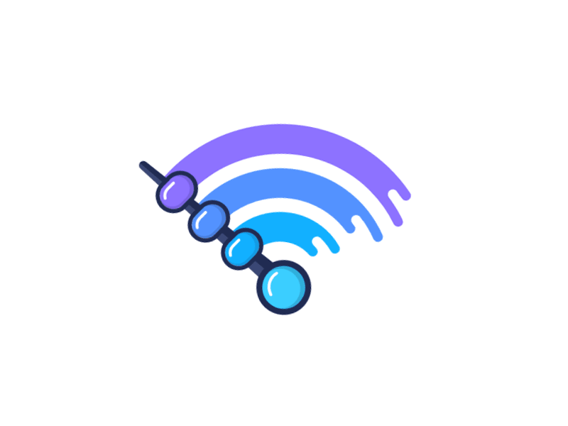

<h1 align="center"><b>Hello Coders</b>
{}</h1>

<h2 align="center">I am here to Learn 🙂 && Contribute🌱</h3> 

&nbsp;

<!-- about me section -->

<h1 align="center"> About Me</h1>
        
- 🔭 I’m currently working on my **Web development and Problem Solving skills(DSA)**.
- 💢 I'm enhancing my **JavaScript Concept** Now A Days
- 🌱 I’m currently pursuing my **Btech** degree in **Computer Science**.
- 🤔 I love to design website **UX|UI**.
- 💝 Happy To Be On Github and looking forward to **learn and contribute** with github members altogether

    <h1 align="center">Technologies(<i>I have worked with</i>)</h1>
    
- 💻 **HTML| CSS | JavaSricpt**.
- 🔧 **C | C++**.
- 🔨 **Bootstrap | Bulma**.
- ✂️ **Figma | UX/UI**.

<!-- project section  -->
<h1 align="center"> My Projects </h1>
<h3 align ="center"> Explore My Projects On Github (All of your feedback are welcomed)</h3>

 <h1 align="center">Stats</h>    

<!-- My Stats On Github  -->

<!-- My Contribution on Github  -->

<!-- Streaks Stats on my github -->

<!-- Most Language Used -->

<!-- Connect With Me  -->
<h1 align="center">Connect with me</h1>  

<a href="#">
      &nbsp;
 </a>
<a href="mailto:srajangarg8273@gmail.com">
      &nbsp;
</a>
   
<a href="#">
      &nbsp;
</a>

<!--
**SrajanAgrawal/SrajanAgrawal** is a ✨ _special_ ✨ repository because its `README.md` (this file) appears on your GitHub profile.

Here are some ideas to get you started:

- 🔭 I’m currently working on ...
- 🌱 I’m currently learning ...
- 👯 I’m looking to collaborate on ...
- 🤔 I’m looking for help with ...
- 💬 Ask me about ...
- 📫 How to reach me: ...
- 😄 Pronouns: ...
- ⚡ Fun fact: ...
-->
